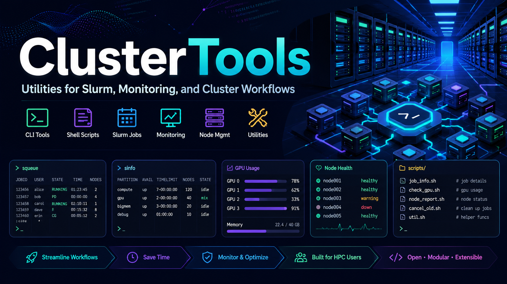

<p align="center">
  
</p>

# Cluster Tools

Kempner AI Cluster Tools: a single umbrella CLI (`clustertools`) that
centralizes the cluster scripts used by both researchers and the engineering
team, so common tasks live in one place with consistent help and behavior.

Every task is a subcommand under a group (for example `clustertools gpu ...`).
Each command has `--help` explaining what it does, its use cases, and its
inputs.

## Requirements

- [uv](https://docs.astral.sh/uv/) for environment and dependency management.
- Run on a cluster login node. Commands shell out to the host's own tools:
  Slurm (`squeue`, `sacct`, `sacctmgr`, `sinfo`, `sshare`, `scontrol`, `srun`),
  `jobstats`, the FASRC `quota` tool, and `getent`. A command only needs
  the tools it uses.
- Some commands need more: the live monitors and `diag ib` need passwordless
  `ssh` to nodes running `nvidia-smi`; `gpu nvtop` needs `tmux` and `nvtop`;
  `diag nvlink` needs `nvcc` and NCCL; `diag nccl` needs `torch`;
  `storage home --ncdu` needs `ncdu`. `jobs scope` uses the bundled `jobscope`
  tool (installed automatically); its GPU views also read a Prometheus endpoint,
  auto-discovered from the cluster's jobstats install.

## Install

Install as a tool from the repository:

```bash
uv tool install git+https://github.com/KempnerInstitute/cluster-tools
```

Or work from a clone:

```bash
git clone https://github.com/KempnerInstitute/cluster-tools
cd cluster-tools
uv sync
uv run clustertools --help
```

## Usage

```bash
clustertools --help              # list command groups
clustertools gpu --help          # list commands in the gpu group
clustertools gpu usage           # rank every account by base-partition GPU usage
clustertools gpu usage kempner_sham_lab      # one account's usage, by user and partition
clustertools nodes list kempner_h100         # node names and states in a partition
clustertools account members kempner_dev     # users in a fairshare account
clustertools storage quota holylfs06 -g kempner_dev  # lab quota on Lustre (or VAST)
clustertools jobs stats 1234567              # utilization for a job
clustertools jobs scope -D 3                  # efficiency of your completed jobs (last 3 days)
clustertools gpu avail kempner_h100          # nodes with allocatable GPUs (ratio-capped)
clustertools jobs violators kempner_h100     # jobs over the per-GPU norm
clustertools gpu monitor-job 1234567         # live per-node GPU/CPU/mem/net table
```

## Commands

Commands are grouped. The table lists every command. For the full reference of
what each does, its use cases, and inputs, see the linked
[`docs/commands/<group>.md`](docs/commands/) file, or run
`clustertools <group> <command> --help`.

| Group | Commands | Scope |
| --- | --- | --- |
| [`gpu`](docs/commands/gpu.md) | `usage`, `avail`, `monitor-partition`, `monitor-job`, `nvtop` | GPU usage and availability |
| [`jobs`](docs/commands/jobs.md) | `stats`, `scope`, `violators` | Job queue and history |
| [`account`](docs/commands/account.md) | `members` | Account membership, limits, fairshare |
| [`nodes`](docs/commands/nodes.md) | `list` | Node status and health |
| [`storage`](docs/commands/storage.md) | `quota`, `home` | Filesystem quotas |
| [`diag`](docs/commands/diag.md) | `ib`, `nccl`, `nvlink` | Diagnostics and benchmarks |

## Project layout

```
src/cluster_tools/
  cli.py              # umbrella group, registers command groups
  process.py          # subprocess helpers (capture / stream)
  slurm.py            # read-only Slurm query and parse helpers
  storage.py          # storage quota command construction
  monitor.py          # shared live per-node monitor (monitor-partition/-job)
  data/               # bundled payloads (monitor sample, nccl test, nvlink .cu)
  commands/           # one package per group; one file per command
    gpu/              # usage, avail, monitor_partition, monitor_job, nvtop
    jobs/             # stats, violators
    account/          # members
    nodes/            # list
    storage/          # quota, home
    diag/             # ib, nccl, nvlink
tests/                # unit tests
docs/commands/        # extended per-group command reference (gpu.md, jobs.md, ...)
```

## Contributing

New commands are added by pull request. See [CONTRIBUTING.md](CONTRIBUTING.md).

## License

MIT. See [LICENSE](LICENSE). Copyright (c) 2026 Kempner Institute, Harvard
University.
