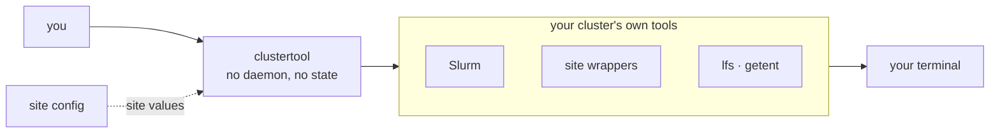

<p align="center">
  <picture>
    <source media="(prefers-color-scheme: dark)" srcset="_static/clustertool-logo-dark.svg">
    
  </picture>
</p>

<p align="center">
  <a href="https://github.com/KempnerInstitute/clustertool/actions/workflows/ci.yml"></a>
  <a href="LICENSE"></a>
  <a href="https://www.python.org/downloads/"></a>
  <a href="https://slurm.schedmd.com/"></a>
  <a href="https://docs.astral.sh/uv/"></a>
  <a href="https://github.com/astral-sh/ruff"></a>
</p>

# ClusterTool

A single umbrella CLI (`clustertool`) that centralizes the Slurm cluster
scripts used by both researchers and the admin team, so common tasks live
in one place with consistent help and behavior. It is built at the Kempner
Institute, Harvard University, and adapts to other clusters through a site
config.

Every task is a subcommand under a group (for example `clustertool gpu ...`).
Each command has `--help` explaining what it does, its use cases, and its
inputs.

## What it runs



Nothing runs as a service and nothing is cached: each command shells out to the
tools your cluster already provides and formats what they return. Every
cluster-specific value comes from a site config, so the same commands work at
another center (see [Configuration](#configuration)).

## Requirements

**To install:** Python 3.10 or newer, plus one of [uv](https://docs.astral.sh/uv/)
(used throughout this README), `pipx`, or `pip`.

**To run:** a login node of a Slurm cluster. Nothing is computed locally. Every
command shells out to the host's own tools and reports what that cluster says, so
a command needs only the tools it actually calls:

- **Slurm**, for most commands: `squeue`, `sacct`, `sacctmgr`, `sinfo`, `sshare`,
  `sprio`, `sstat`, `sdiag`, `scontrol`, `salloc`, `sbatch`, `scancel`, `srun`.
- **Site tools**, for the commands that wrap them. At the Kempner Institute these
  are the FASRC wrappers `showq`, `spart`, `lsload`, `stotal` and `seff-account`,
  plus `jobstats` and `quota`. A command whose tool is missing hides itself from
  help instead of failing, and another site can point each one at its own
  equivalent (see [Configuration](#configuration)). The Lustre and account
  membership commands call `lfs` and `getent` directly.
- **Extras**, for a handful of commands: passwordless `ssh` to compute nodes
  running `nvidia-smi` (the live monitors, `diag ib`, `gpu pulse --node`), `tmux`
  and `nvtop` (`gpu nvtop`), `nvcc` and NCCL (`diag nvlink`), `torch`
  (`diag nccl`), and `ncdu` (`storage home --ncdu`). `tmux`, `nvtop` and `ncdu`,
  plus `sdiag` above, are `[tools]` keys as well, so a site can rename them:
  `gpu nvtop` and `diag scheduler` hide without `tmux` and `sdiag`, while `ncdu`
  gates only `storage home --ncdu` and `nvtop` is checked on the remote node.

Two tools ship with clustertool and install automatically. `jobs scope` uses
`jobscope`, whose GPU views also read a Prometheus endpoint discovered from the
cluster's `jobstats` install. `gpu pulse` uses `kempnerpulse`; run it on a GPU
node, where it reads counters through `dcgmi`, or from a dcgm-exporter Prometheus
endpoint with `--backend prometheus`.

## Install

```bash
uv tool install clustertool   # or: pipx install clustertool, pip install clustertool
```

The install name is singular. Unrelated projects hold `clustertools` and
`cluster-tools` on PyPI, so check the spelling. The command it puts on your PATH
is `clustertool`, along with the bundled `jobscope` and `kempnerpulse` tools.

To track the development version instead:

```bash
uv tool install git+https://github.com/KempnerInstitute/clustertool
```

Or work from a clone:

```bash
git clone https://github.com/KempnerInstitute/clustertool
cd clustertool
uv sync
uv run clustertool --help
```

Enable tab completion for your shell (bash, zsh, fish), then restart it:

```bash
clustertool completion --install
```

## Usage

```bash
# Discover
clustertool --help      # list command groups
clustertool gpu --help  # list a group's commands
clustertool search fairshare  # find a command by keyword (also: find, lookup)
clustertool me                # your jobs, GPUs, and fairshare at a glance
clustertool me --access       # also: accounts, partitions, and QoS you can submit under

# GPU
clustertool gpu usage                   # rank every lab by base-partition GPU usage
clustertool gpu usage kempner_sham_lab  # one lab's usage, by user and partition
clustertool gpu avail kempner_h100      # nodes with allocatable GPUs (ratio-capped)
clustertool gpu session a100 -A LAB     # interactive single-GPU shell (a100/h100/h200/rtx)
clustertool gpu monitor-job 1234567     # live per-node GPU/CPU/memory/network table
clustertool gpu pulse                   # live per-GPU dashboard (on a GPU node)
clustertool gpu pulse --node holygpu123 # ...or launch it on a remote GPU node

# Jobs
clustertool jobs list           # your queued and running jobs
clustertool jobs why 1234567    # why a job is pending, and its priority
clustertool jobs debug 1234567  # why a finished job failed, with a suggested fix
clustertool jobs stats 1234567  # utilization for a job
clustertool jobs scope -D 3     # efficiency of your completed jobs (last 3 days)
clustertool jobs new            # build a correct GPU sbatch script (prompts, or --submit)

# Accounts and nodes
clustertool account fairshare            # your fairshare and priority standing
clustertool account members kempner_dev  # users in a fairshare account
clustertool nodes partitions -f kempner  # partitions, GPUs, and limits
clustertool nodes list kempner_h100      # nodes and states in a partition

# Storage
clustertool storage quota netscratch  # your quota on a filesystem (-g LAB for a lab)
clustertool storage quota --all       # every lab dir you belong to, as a usage table
clustertool storage scratch           # scratch usage and the site's purge reminder
clustertool storage home              # home directory usage and quota
```

## Commands

Most commands live in a group; a few are top-level (`search`, `completion`,
`me`). The table below lists each group's commands. For the full reference of
what each does, its use cases, and inputs, see the linked
[`docs/commands/<group>.md`](docs/commands/) file, or run
`clustertool <group> <command> --help`.

A flat, greppable index of every command, with its scope (user or admin) and the
host tool it wraps, is in
[`clustertool-commands-index.md`](clustertool-commands-index.md).

Not sure which command you need? `clustertool search <words>` (also `find` or
`lookup`) ranks commands by relevance, for example `clustertool search
fairshare` or `clustertool search gpu reservation`.

| Group | Commands | Scope |
| --- | --- | --- |
| [`gpu`](docs/commands/gpu.md) | `usage`, `util`, `status`, `avail`, `session`, `monitor-partition`, `monitor-job`, `nvtop`, `pulse` | GPU usage, availability, and sessions |
| [`jobs`](docs/commands/jobs.md) | `list`, `queue`, `show`, `why`, `top`, `stats`, `scope`, `history`, `log`, `script`, `priorities`, `violators`, `wait-times`, `failures`, `cancel`, `hold`, `release`, `requeue`, `set-priority`, `submit`, `new`, `debug` | Job queue, status, history, logs, and control |
| [`account`](docs/commands/account.md) | `members`, `fairshare`, `balance`, `usage`, `limits`, `top-users`, `qos`, `add-user`, `remove-user`, `set-fairshare` | Account membership, fairshare, usage, limits, QoS |
| [`nodes`](docs/commands/nodes.md) | `list`, `partitions`, `down`, `load`, `frag`, `reservations`, `resume` | Node, partition, and reservation status |
| [`storage`](docs/commands/storage.md) | `quota`, `home`, `vast-usage`, `scratch`, `lfs-stripe`, `lfs-inodes` | Filesystem quotas, usage, and striping |
| [`diag`](docs/commands/diag.md) | `gpu-health`, `ib`, `ib-affinity`, `ib-counters`, `ib-snapshot`, `ib-verify`, `io-probe`, `nccl`, `nvlink`, `scheduler` | Diagnostics and benchmarks |
| [`qos`](docs/commands/qos.md) | `holders`, `create`, `modify`, `delete`, `grant`, `revoke`, `retire`, `sync` | QoS holders and (admin) provisioning and assignment |

## Configuration

clustertool defaults to the Kempner AI Cluster. **The site config is the only
place a cluster's specifics live** (partitions, per-GPU limits, GPU types,
account conventions, storage paths), so another center points those keys at its
own values and keeps the same commands. That makes adoption mostly a matter of
description rather than integration. A command whose site wrapper is missing
hides itself from help instead of failing, so a center that has no `showq`
simply has no `jobs queue`.

See [`docs/configuration.md`](docs/configuration.md) for the config reference and
[`docs/porting.md`](docs/porting.md) for a step-by-step adoption guide.

## Project layout

```
src/clustertool/
  entry.py            # console-script entry point
  cli.py              # umbrella group, registers command groups
  site.py             # site config; every cluster-specific value is read here
  grouping.py         # help layout, group markers, tool-backed command class
  process.py          # subprocess helpers (capture / stream)
  slurm.py            # read-only Slurm query and parse helpers
  storage.py          # storage quota command construction
  monitor.py          # shared live per-node monitor (monitor-partition/-job)
  gpuhealth.py        # nvidia-smi parsing and GPU health verdict (diag gpu-health)
  ioprobe.py          # filesystem write/read/metadata probe (diag io-probe)
  fabric.py           # InfiniBand topology/affinity/snapshot helpers (diag ib-*)
  qos.py              # read-only Slurm QoS queries and limit-spec builder
  search.py           # command ranking for 'clustertool search'
  completion.py       # shell completion and dynamic value completion
  data/               # bundled payloads (monitor sample, nccl test, nvlink .cu)
  commands/           # one package per group; one file per command
    gpu/              # usage, util, status, avail, session, monitor_partition, monitor_job, nvtop, pulse
    jobs/             # list, queue, show, why, top, stats, scope, history, log, script, priorities, violators, wait-times, failures, cancel, hold, release, requeue, set-priority, submit, new, debug
    account/          # members, fairshare, balance, usage, limits, topusers, qos, adduser, removeuser, setfairshare
    nodes/            # list, partitions, down, load, frag, reservations, resume
    storage/          # quota, home, vast-usage, scratch, lfs-stripe, lfs-inodes
    diag/             # gpu_health, ib, ib_affinity, ib_counters, ib_snapshot, ib_verify, io_probe, nccl, nvlink, scheduler
    qos/              # holders, create, modify, delete, grant, revoke, retire, sync
tests/                # unit tests
docs/commands/        # extended per-group command reference (gpu.md, jobs.md, ...)
```

## Contributing

New commands are added by pull request. See [CONTRIBUTING.md](CONTRIBUTING.md).

## License

MIT. See [LICENSE](LICENSE). Copyright (c) 2026 Kempner Institute, Harvard
University.
