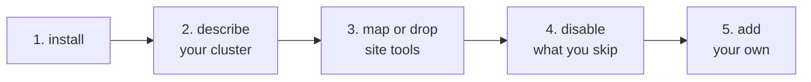

# Porting clustertool to another cluster

clustertool ships tuned for the Kempner AI Cluster, but nothing in the commands
is hardwired to it. Another Slurm site adopts it in a few steps. See
[configuration.md](configuration.md) for the full config reference.

Steps 1 and 2 are enough to get a working tool: most commands are generic Slurm
and need no configuration at all. Steps 3 through 5 are refinements you can make
whenever they become worth it.

## 1. Install

    uv tool install git+https://github.com/KempnerInstitute/clustertool

The generic commands, which are most of the tool, work immediately on any Slurm
cluster.

## 2. Describe your cluster

Create a `site.toml` with the values that differ from the Kempner default and
point clustertool at it:

    export CLUSTERTOOL_SITE_CONFIG=/path/to/site.toml

or deploy it to `/etc/clustertool/site.toml` so every user picks it up. A single
user can also keep one at `~/.config/clustertool/site.toml`, which is the
easiest way to try a config out before rolling it to the cluster; the
environment variable wins, then the user file, then the system one. Only the
keys you set change; the rest keep the packaged defaults, except `[gpu_types]`
and `[partitions.limits]`, which replace outright so you must list every entry
you want. A minimal example:

    [site]
    name = "Example HPC"

    [partitions]
    base = ["gpu", "gpu-shared"]
    requeue = "gpu"

    [partitions.limits.gpu]
    cpus_per_gpu = 8
    mem_per_gpu_mb = 100000

    [gpu_types]
    a100 = "gpu"

    [accounts]
    roster_partition = "gpu"
    lab_prefix = "lab_"

    [storage]
    path_prefix = "/scratch"
    scratch = "/scratch/tmp"
    scratch_purge_days = 30

If you plan to use the admin `qos` commands, set the cluster they write to as
well, because the default is the Kempner cluster name:

    [qos]
    cluster = "your-cluster-name"

## 3. Map or drop the site tools

Some commands wrap tools that may not exist on your cluster, or exist under
another name: `showq`, `spart`, `lsload`, `stotal`, `seff-account`, `jobstats`,
the FASRC `quota` wrapper, `lfs`, `sdiag`, `tmux`, `nvtop` and `ncdu`. Point each
`[tools]` key at your equivalent binary, or leave it: a command whose tool is
missing simply hides itself.

Two of those are not whole commands. `ncdu` backs a single flag, so `storage
home` stays available without it and only `--ncdu` reports it missing, and
`nvtop` runs on the compute node rather than locally, so it is never checked
here.

    [tools]
    queue = "my-queue-tool"

## 4. Turn off commands you do not want

    [commands]
    disable = ["jobs scope", "diag nvlink"]

Disable a whole group by its name, for example `["diag"]`.

## 5. Add your own commands

Ship a small package that declares a `clustertool.commands` entry point for
each command or group you add; clustertool loads them at startup next to the
built-ins:

    [project.entry-points."clustertool.commands"]
    mycmd = "my_package.cli:mycmd"

No fork needed: your site keeps a config file and, optionally, a plugin package,
and pulls core updates as they ship.
